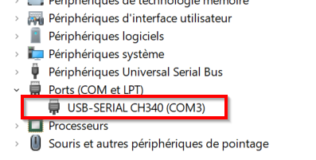
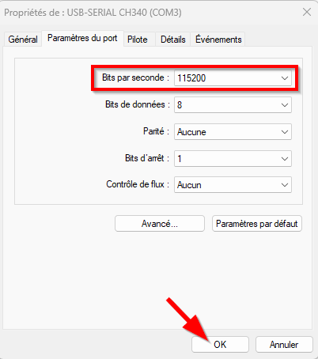
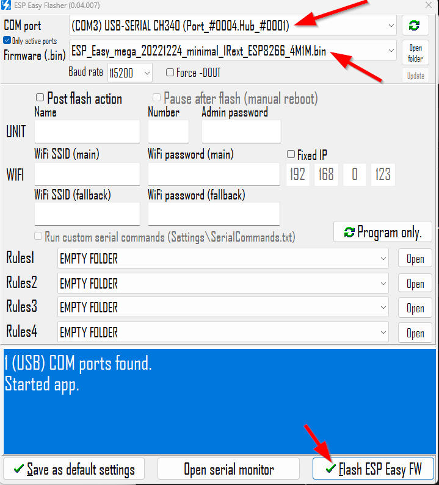
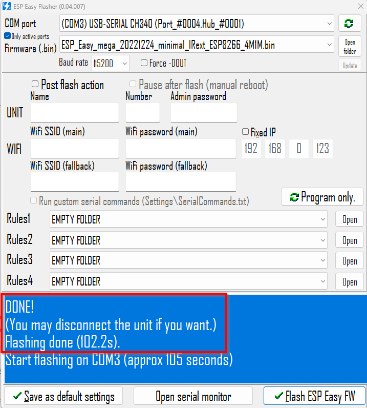

# En cours d'écriture

Cette page s'inscrit dans une opération plus globale qui consiste à inclure un module esp8266 dans le plugin ESPEasy de Jeedom. Sa fonctionnalité sera de servir d'émetteur IR pour contrôler une unité intérieure d'une climatisation.

La 1ère étape décrite dans cette page consiste donc à flasher un firmware ESPEasy dans un wemos d1 mini et de le paramétrer. Le protocole est donc tout à fait valide pour tout type de finalité.

# Identification du module par Windows

Avant toute chose, il est nécessaire de s'assurer que le module est identifié correctement par Windows.

* Commencer par brancher le module à votre ordinateur via le port USB
* Ouvrir le gestionnaire de périphériques
* Identifier votre module dans la catégorie Ports (COM et LPT)
* Et tout particulière le port COM sur lequel votre module est "branché". Ici il s'agit du COM3.

* Faites un click-droit sur votre module pour ouvrir la boite des propriétés.
* Choisir l'onglet "Paramètres du port", puis modifier le "nombre de bits par seconde" en le passant à 115200.
* Valider en cliquant le bouton OK.

# Flasher le module

Pour cela, nous allons utiliser le logiciel EspEasy.

## Récupérer le logiciel

* Depuis la page [Releases ESPEasy](https://github.com/letscontrolit/ESPEasy/releases), télécharger le package _ESPEasy_ESP82xx_mega-xxxxxx.zip_ (à l'heure actuelle, le fichier est ESPEasy_ESP82xx_mega-20221224.zip).
* Extraire le contenu du zip
* Double-cliquer sur l'exécutable nommé *ESP.Easy.Flasher.exe*

## Flasher à proprement parler le module

ESPEasy se lance sous forme d'une boite de dialogue très simple.

* Commencer par sélectionner votre module en choisissant le port COM correspondant (dans mon cas, le port COM3). Vous pouvez utiliser le bouton de rafraichissement si vous venez de connecter votre module.
* Ensuite il faut choisir le type de firmware à flasher dans le module. Cela se fait en fonction des fonctionnalités que vous allez donner à votre module.
Dans mon cas, je vais choisir le firmware *ESP_Easy_mega_20221224_minimal_IRext_ESP8266_4M1M* puisqu'il va jouer le role d'une télécommande IR.
* Pour lancer l'opération de flashage, il suffit de cliquer sur le bouton **Flash ESP Easy FW**.

* Il convient d'attendre un peu de temps et ...

## Réinitialiser intégralement le module

Il est tout à fait possible de réinitialiser le module en flashant une image vide, pour cela, il faut choisir le firmware **blank_4MB**.

## Paraméter le module

*
