Cet article fait un peu le résumé de toutes mes recherches sur la notion de `boitier éthanol` car effectivement le fait de pouvoir rouler un peu moins cher à suscité en moi une certaine curiosité.

# Quelques généralités

## Boitier éthanol, késako ?

Les boîtiers E85 sont des boitiers électroniques qui se positionnent sous le capot, au niveau du moteur. Ils permettent au moteur d’injecter la bonne quantité de carburant en fonction de la proportion d’éthanol présente dans le réservoir pour un fonctionnement optimal. Ils viennent donc se placer entre le calculateur moteur et les injecteurs.
Une sonde mesure la proportion d’éthanol dans le carburant. Plus elle est élevée plus le boîtier E85 augmentera la quantité de carburant injecté. Le boîtier E85 s’assure que le moteur reçoit bien la quantité d’énergie prévue par le calculateur en ajustant le volume de carburant injecté.

## Quel type choisir ?

En faisant quelques recherches, on s'aperçoit rapidement que 2 types de boitiers existent. D'un côté, ceux composés d'un boitier et d'un capteur de carburant, et ceux uniquement composé d'un boitier.
Je ne parlerais que des 1ers, car je reste sceptique qu'en a la qualité des signaux d'injections des modèles sans capture du carburant. En effet, comment modifier le temps d'injection avec précision si l'on ne connait pas la ratio d'éthanol précisément ?
Donc pas d'hésitation, il s'agit d'ors et déjà de ne cibler que des boitiers ayant un capteur de carburant.

> Un des avantages que je vois également avec le système à capteur, c'est qu'il est possible de rouler avec la proportion d'éthanol que l'on souhaite sans avoir à ce soucier d'une forme d'adaptation du boitier. Également, il n'est pas nécessaire de faire un plein en 2 fois (éthanol puis sans plomb).

## Quel est le principe de fonctionnement ?

Il s'agit tout simplement de garder ouvert un peu plus longtemps les injecteurs afin que ces derniers envoient plus de carburant. Pour cela on va intercaler entre le calculateur et les injecteurs un autre calculateur (le fameux boîtier éthanol). Ce dernier sera connecté à une sonde mise à l'arrivée de carburant pour qu'il sache si il doit retarder ou pas la fermeture des injecteurs. Si il n'y a pas de sonde de carburant avec le boîtier alors il ne sera pas au courant si il fonctionne à l'éthanol ou au sans plomb, et dans ce cas seule la sonde lambda pourra corriger en partie la richesse. L'idéal reste donc que le boîtier soit aussi au courant du carburant utilisé afin qu'il augmente ou pas les temps d'ouverture des injecteurs.
Dans le cas où il y a de l'éthanol, ce dernier va ouvrir plus longtemps les injecteurs, ce qui permettra donc d'arriver au dosage 10/1 de l'éthanol (en réalité un peu plus, car on ne tourne pas à 100% d'éthanol en France : E85%). C'est donc lui qui va déduire le temps d'ouverture supplémentaire à faire faire aux injecteurs.
D'un autre côté, le calculateur va lui aussi finit d'adapter au mieux le dosage avec ce que lui renvoie la sonde lambda. Il va donc permettre de peaufiner au millimètre les réglages pour optimiser la consommation et les émissions de polluants (et cela malgré que le boîtier éthanol augmente ce dosage en aval).

## Est-ce bien légal tout cela ?

Alors oui et non. 
Il existe bien des boitiers dit homologués. Dans ce cas, l'installation se fait par un professionnel et la prestation inclut également le changement de carte grise. Ils ont un cout d'environ 800 €. Petite précision qui à son intéret tout de meme, en cas de revente du véhicule, la carte grise est gratuite pour le nouvel acquéreur :wink:.
Ces mêmes vendeurs proposent également des modèles non homologués. Ceux-ci sont à monter par soi-même et coutent environ 400 €. Le point de vérification sera de bien s'assurer d'avoir fait un plein complé au sans-plomb avant de réaliser le controle technique.
En effet, le fait de venir mettre de l'éthanol va changer les caractéristiques d'émission de votre véhicule donc même si vous polluez moins vous serait hors gabarit.
Ainsi la différence de prix et donc d'amortissement de l'achat m'a décidé pour un modèle non homologué.

# Dans mon cas

## Mon choix

Pour notre Clio 4 équipée d'un moteur TCe 90cv de 900 cm3, je me suis décidé pour un boitier `eFlexEco` de la société [eFlexFuel Technology](https://eflexfuel.com/fr).
Pourquoi ? Pour les avis, la qualité apparente du produit, l'historique de la société, les nombreux retours des utilisateurs et surtout la qualité des guides techniques d'installation mis en ligne.

## L'installation

L'installation en soit n'est pas bien compliquée dès lors que l'on dispose d'une petite caisse à outils classique et de quelques notions de bricolage mécanique.
En effet, le point le plus dangereux de la manipulation consiste à venir dériver la conduite d'admission du carburant de la rampe d'injection vers le capteur d'analyse du carburant.
À noter qu'il est important de se munir d'un bon lot de serflex, en effet la boite d'installation n'en contenant qu'un nombre limité.

> À noter que je n'avais pas fait de complément en éthanol dans le réservoir, j'étais à environ la moitier du réservoir en SP98.

De façon schématisé, voici l'implentation des différents éléments à ajouter.
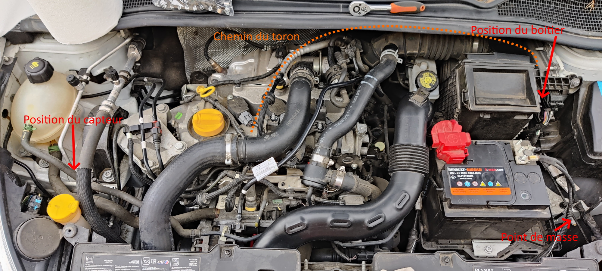

### Le capteur

Avant de commencer, il est nécessaire de définir à quel endroit sera installé le capteur.
Pour ma part, j'ai décidé de le fixer sur la patte de fixation des durites de liquide de refroidissement juste au-dessus du réservoir de liquide de lave vitre. 

#### Enlever la durite d'alimentation en carburant

> Il va falloir venir retirer la durite d'alimentation de carburant matérialisée par les 2 fleches rouge.
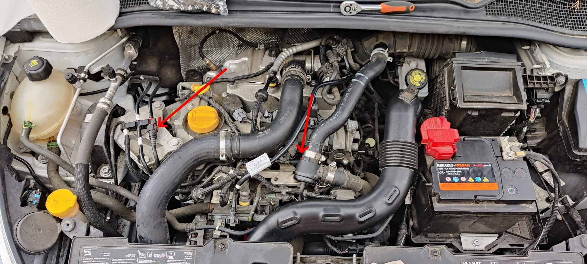

> Retirer l'extrémité de la durite située au niveau de la rampe d'injection en appuyant fortement sur le clips rouge.

> Faire de même pour l'autre extrémité.
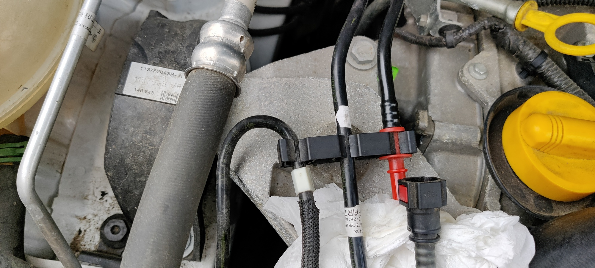

> Retirer maintenant la durite. Pensez à la stocker à l'abris de façon à pouvoir la remettre si vous retiriez le boitier à l'avenir.
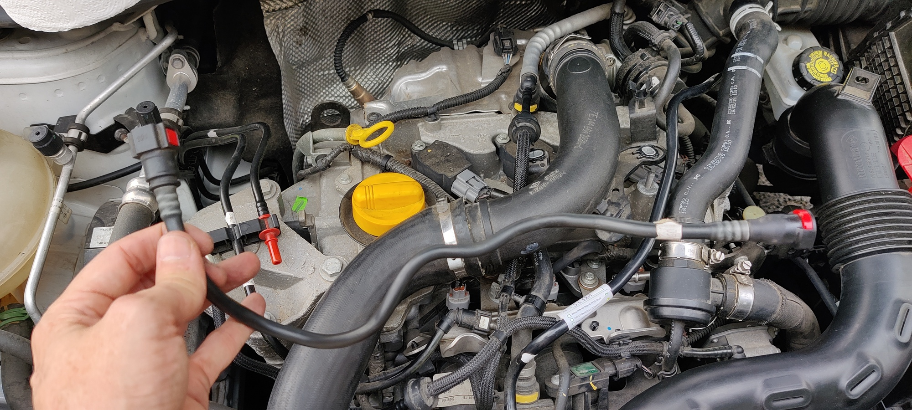

#### Préparer la nouvelle durite avec le capteur

> Pour faciliter les prochaines étapes, vous pouvez déviser la durite d'admission d'air et la décaler sur la gauche. De même pour la durite pneumatique, vous pouvez la déloger et également en déclipser l'extrémité pour totalement l'enlever de votre zone de travail (nb : on ne le voit pas sur la photo).
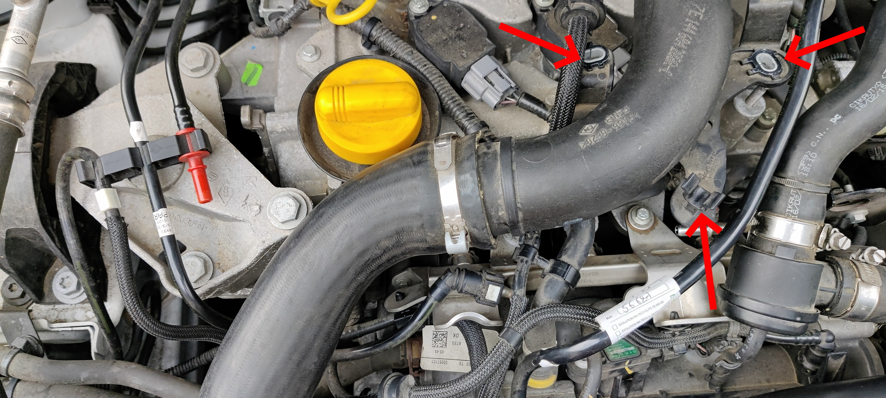

> Il s'agit maintenant d'utiliser les adaptateurs rapides fournis dans le kit. J'ai isolé sur la photo ceux qui m'intéressent.
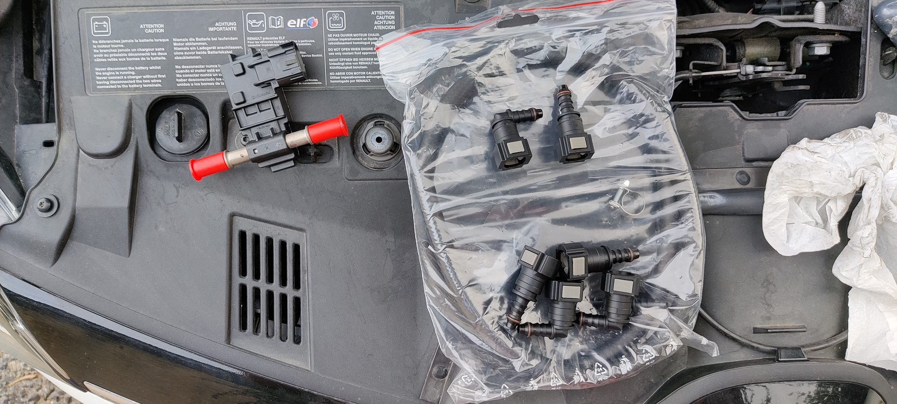

> Venir clipser le 1er sur la rampe d'injection (en forçant légérement).
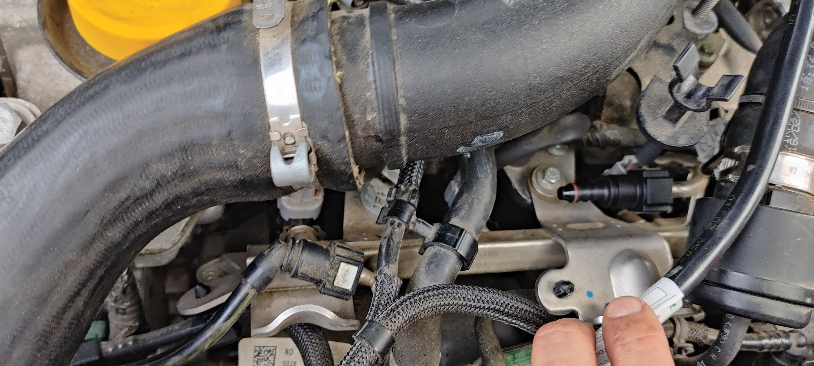

> Venir clipser celui qui est coudé à l'autre extrémité.
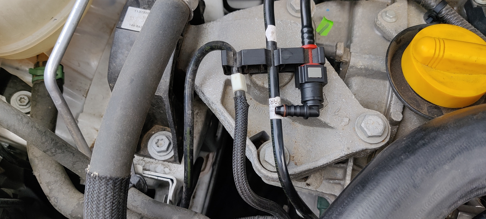

> En fonction de la zone où sera fixé le capteur, il faut couper le tuyau flexible d'alimentation en carburant.
> Penser à positionner les colliers de serrage adaptés avant de venir insérer le tuyau aux adaptateurs et le capteur.
> Serrer les collier fermement mais sans trop écraser la durite.
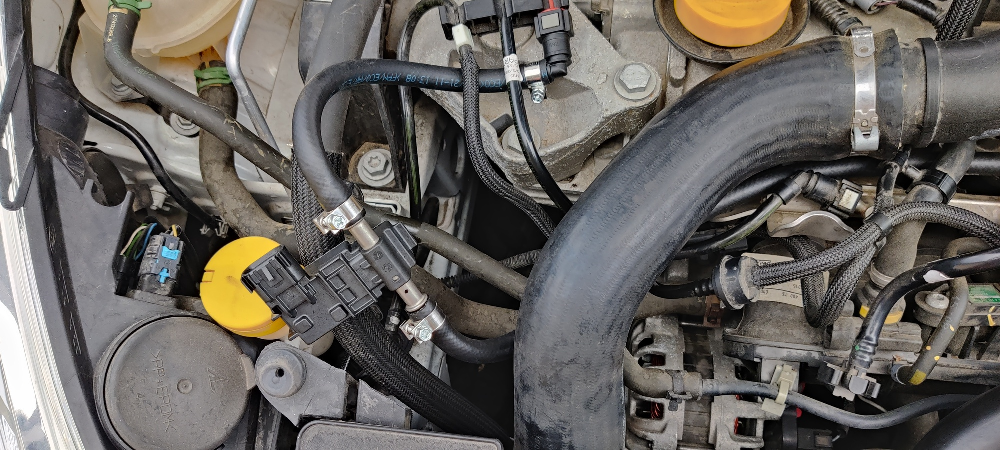

> Faire de même pour l'autre extrémité.
> À noter que pour des raisons de faciliter d'accès pour les étapes suivantes, je n'ai pas conserver cette attache en place.

> Venir fixer le capteur d'analyse avec des serflex.
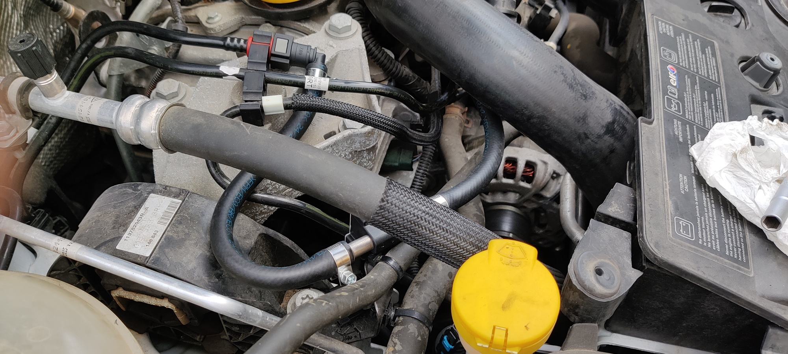

### Le faisceau électrique et le capteur

De même que précédemment, il faut se poser un peu pour définir où sera positionné le boitier ainsi que le passage des différents câbles.
Dans mon cas, le boitier sera inséré sur la tranche entre la batterie et le calculateur moteur.
Les câbles seront regroupés en toron en passant à l'arrière de la boite à air.

#### Préparer le faisceau

Au déballage, le faisceau n'est pas complet. En effet, il est nécessaire de venir s'assurer de la polarité des injecteurs pour positionner correctement les connecteurs fournis.

Pour vérifier la polarité des injecteurs, il faut commencer par déclipser les connecteurs des injecteurs.

> Pour cela, il est nécessaire d'utiliser une pince à bec long pour venir décoller la patte de clipsage du connecteur.
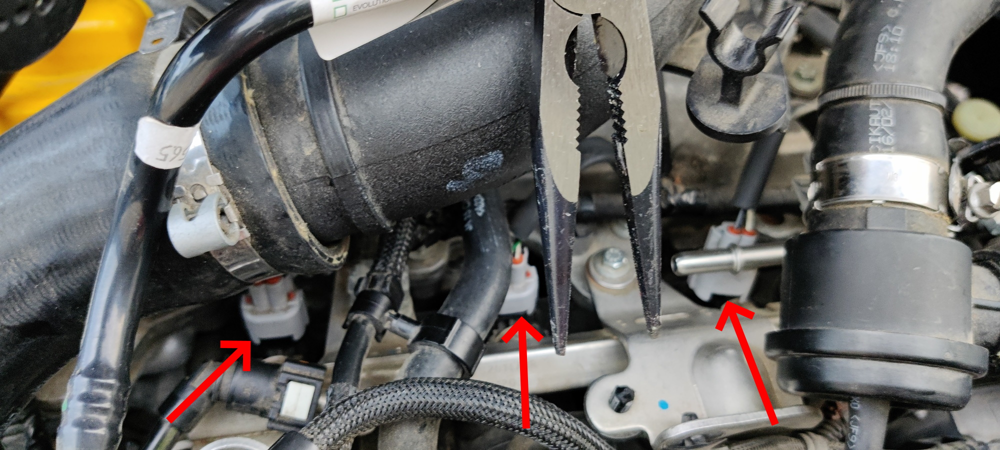

> Une fois fait, à l'aide d'un multimêtre en position `continuité de courant`, venir identifier les cables servant de `+`.
> Dans mon cas, il s'agissait du cable noir/blanc positionné à droite du connecteur (avec la patte de clipsage en fond).
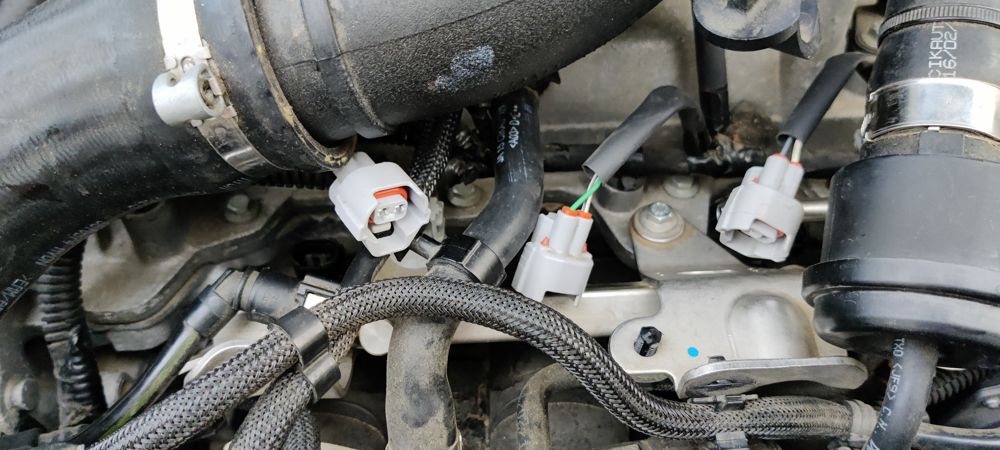

> Dans votre attelier, venir insérer les pinoches dans les connecteur en vous assurant de respecter la position du cable `+`.
> Pour vous assurer d'une étanchéité et d'un clipsage parfait de la pinoche dans le connecteur, venir la tirer avec une pince à bec long jusqu'à entendre le petit clic.

#### Installer le faisceau

> De retour devant votre moteur, venir faire le branchement des connecteurs.
> Attention à bien veiller à brancher **le connecteur disposant d'une gaine rouge**, c'est l'injecteur principal qui alimente les autres.
> Construire également votre toron en utilisant des serflex tous les 7/10 cm de façon à optenir un toron très serré.
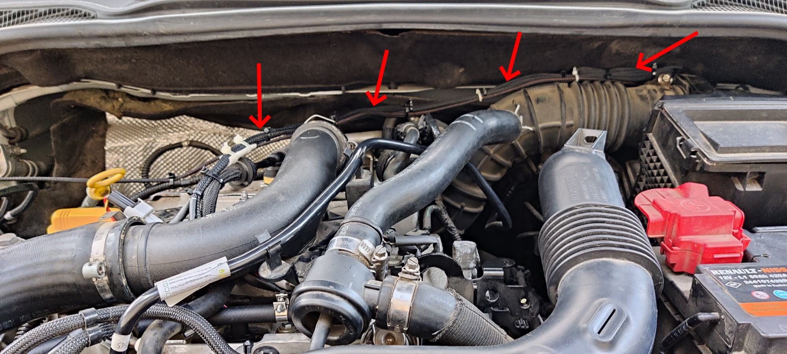

#### Installer le capteur de température

> Installer le capteur de température moteur au niveau du bouchon de remplissage d'huile.
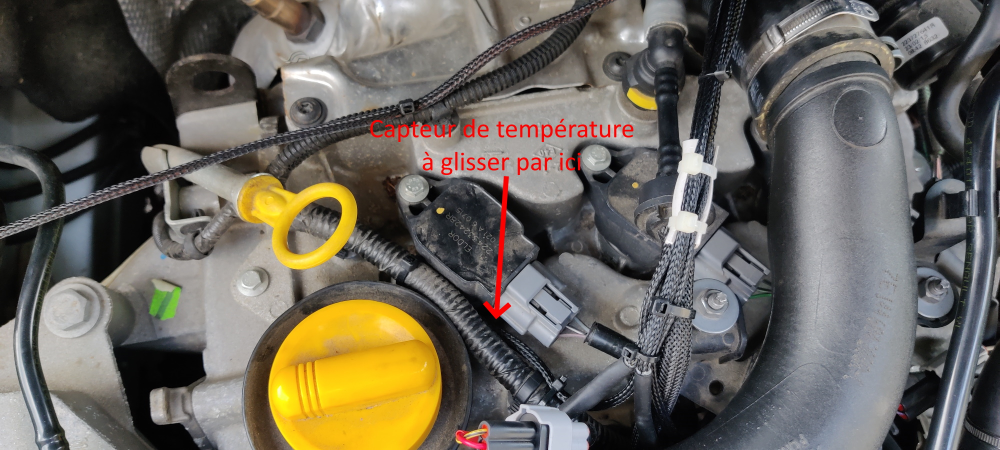

#### Clipser le connecteur du capteur d'analyse de carburant

> Faire courir le cable jusqu'au capteur.

#### Relier le faisceau à la masse véhicule

> Du faisceau électrique part un cable noir de masse. Il est nécessaire de le fixer à un point de masse du véhicule.
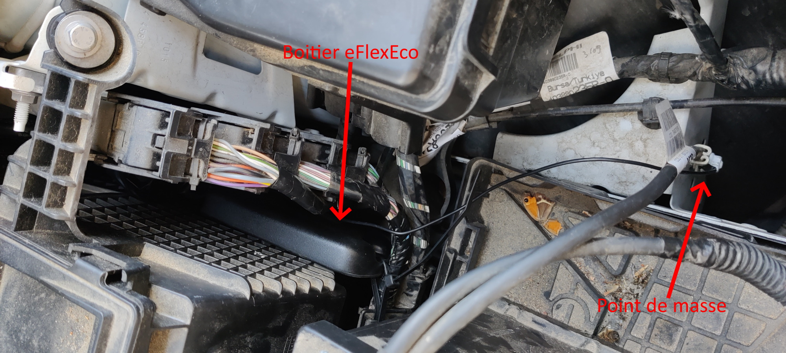

#### Fixer le boitier

> Utiliser un serflex pour fixer le boitier.

## Premier démarrage et vérification

### Installer l'application eFlexApp

Avant de procéder au démarrage, installer sur votre smartphone l'application eFlexApp.
Elle vous permettra de savoir si l'installation est optimum.

### Démarrer le moteur

Logiquement votre véhicule démarrera normallement. D'après la notice, il est possible que l'on doive tirer un peu sur le démarreur.
Ce ne fut pas mon cas, le moteur a démarré comme d'habitude.

Maintenant démarrer l'application et sélectionner eFlexFuel au niveau du bluetooth.

L'accueil affiche entre autre les injecteurs connectés au boitier sous la forme d'un carré vert.
Dans mon cas, le moteur ne dispose que de 3 cylindres et on voit que les cylindres #1, #3 et #4 sont connectés et opérationnels.



Aller également voir dans les erreurs depuis le menu de l'application. Si tout va bien, vous devriez voir cela



Enfin l'entrée _Liste des données_ vous affiche certaines informations, à vous de voir ce que vous pouvez en faire.



### Premier passage à la pompe.

C'est du bonheur, la 1ère fois, j'ai mis 29 litres pour un peu plus de 17 € :satisfied:

## A l'usage

Nous avons maintenant parcouru plus de 1000km et à vrai dire, nous ne notons aucun changement en ce qui concerne le véhicule.
Toujours la même consommation, toujours le même comportement routier, aucun changement perceptible au quotidien.

> Attention cependant au filtre à essence qu'il va falloir changer environ 3 ou 4 pleins après le passage à l'éthanol.
> En effet, l'éthanol étant plus « corrosif » que l'essence, son effet détergeant sur les impuretés et saletés multiples deposées dans le réservoire vont se retrouver dans le filtre.
> Si le filtre se trouve être trop encrassé alors la pompe à injection va forcer plus que de nécessaire.